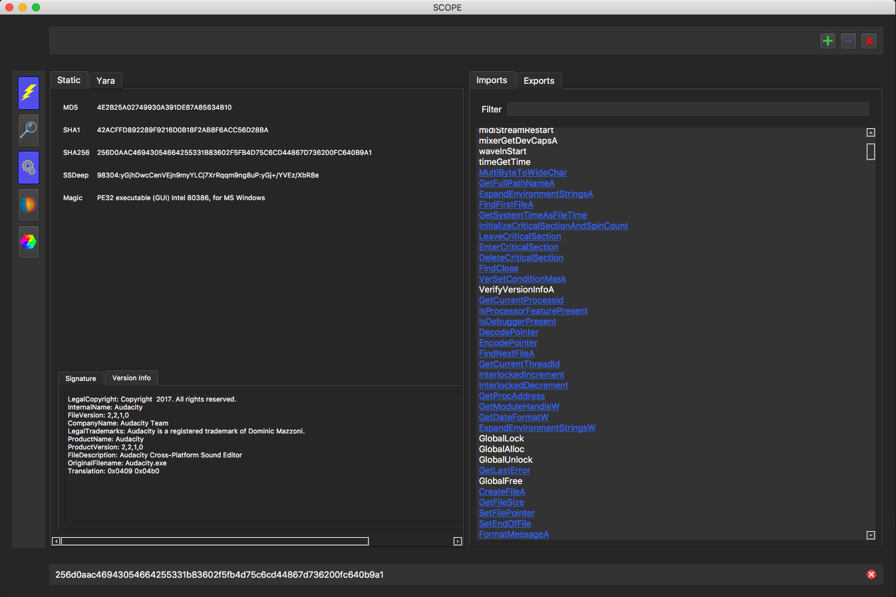
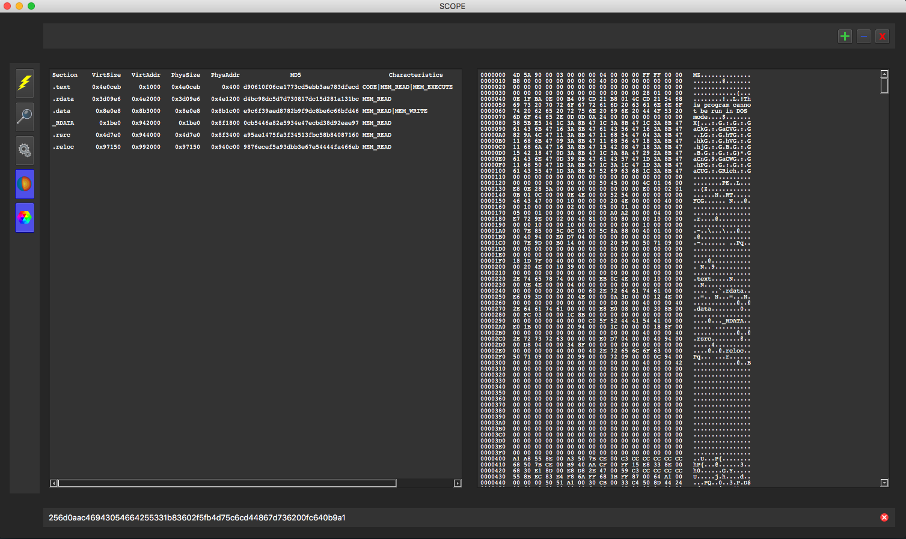
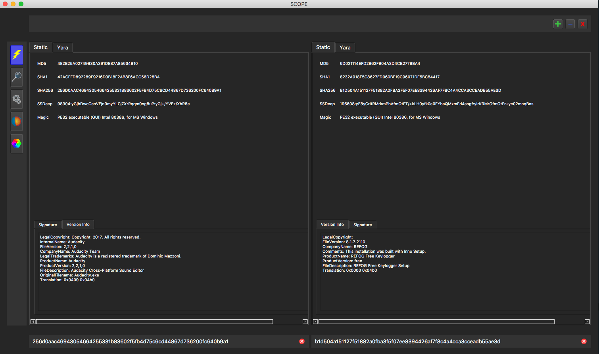

# CySCOPE

## About

		Static Characterstics Of Portable Executables

## Requirements

		Python3 - PyQt5, ssdeep, python-magic, requests, M2Crypto, yara-python and pefile
		
		M2Crypto (Python3) - https://gitlab.com/m2crypto/m2crypto/blob/master/INSTALL.rst
		
		*On Mac some packages might need to be brew installed

## Arguments:

  		-f FILE, 		--file FILE 				File to load

## Screenshots:

